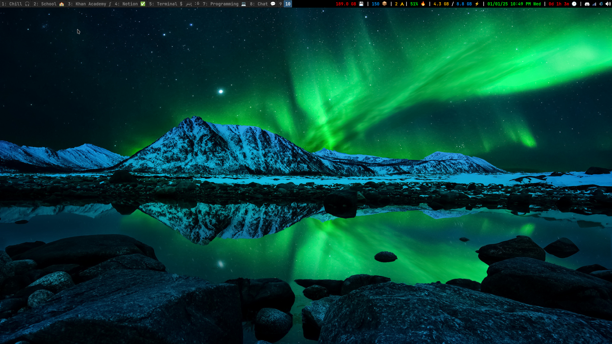

# About DevHKhan/dotfiles

This is my collection of configuration files that I have on my Arch Linux system. For context, I run a system that uses the i3 window manager, the fish shell, and the Neovim text editor.

# What My Current Setup Looks Like

