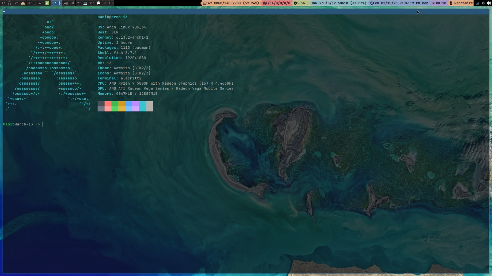

# About DevHKhan/dotfiles

This is my collection of configuration files that I have on my Arch Linux system. For context, I run a system that uses the i3 window manager, the fish shell, and the Neovim text editor.

# What My Current Setup Looks Like

# Explaining My Setup

## Workspaces

Like many i3 configurations, my setup features ten workspaces.

### Workspace 1

My first workspace is labeled "1: 🎧." I use this workspace whenever I want to relax and do some fun things. For example, I will often have YouTube open here, and I often play chess on this workspace. Anything of that nature will typically be found in this workspace.

### Workspace 2

My second workspace is labeled "2: 🏫." I use this workspace for my school assignments and other things related to school.

### Workspace 3

My third workspace is labeled "3: ∫." I use this workspace for Khan Academy, especially when I work on AP Calculus BC.

### Workspace 4

My fourth workspace is labeled "4: ✅." I use this workspace for Notion.

### Workspace 5

My fifth workspace is labeled "5: $." I use this workspace for opening my terminal.

### Workspace 6

My sixth workspace is labeled "6: پښتو." I use this workspace for content related to the Pashto language. Currently, I am working on a [website](https://devhkhan.github.io/) to teach people Pashto.

### Workspace 7

My seventh workspace is labeled "7: 💻." I use this workspace for programming.

### Workspace 8

My eighth workspace is labeled "8: 💬." I use this workspace for chatting.

### Workspace 9

My ninth workspace is labeled "9." I use this workspace for miscellaneous things.

### Workspace 10

My tenth workspace is labeled "10." Just like with workspace 9, I use this workspace for miscellaneous things.

## Status Bar

I use the [bumblebee-status](https://github.com/tobi-wan-kenobi/bumblebee-status) status bar to display system information and other things that I find useful. I chose bumblebee-status for its aesthetics (especially with the [Iceberg Rainbow](https://bumblebee-status.readthedocs.io/en/main/themes.html#id12) theme that I use).

Below, I have listed the sections of my status bar from left to right.

* Disk Space
* Pacman Updates
* CPU Usage
* Memory Usage
* Date and Time
* Uptime
* Random Wallpaper Selector